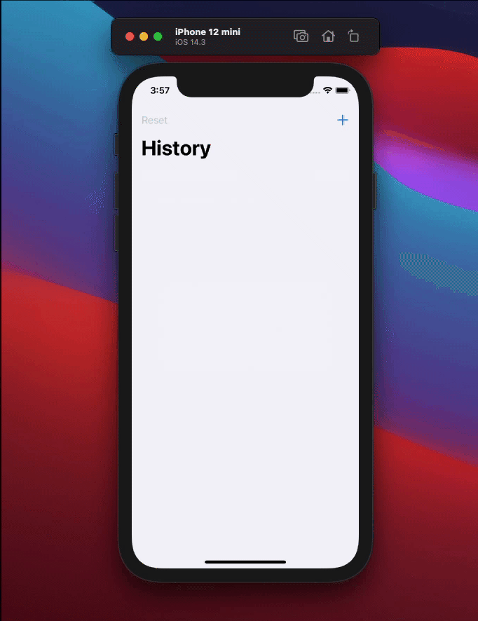

# Airlock

This app is currently on TestFlight!  
https://testflight.apple.com/join/rfPbYjXH

## A two minutes meditation app.

The concept of the app is simple. 

We are inviting you to close your eyes and observe your breath for two minutes, the bare minimum of a unit of time. But did you ever realise how long are two minutes when you try to focus on your breath?  
In the app two more settings are available by long pressing on the title.  
You can select 20 min or one hour. At the end of the meditation time there will be a soft bell sound or a vibration (on iPhone only).

There are different animations in the app. The buttons, the ring slowly closing when the timer progresses and some clouds floating around when the meditation is in progress, in case you were peeking.

There is a full fledged settings page and there will be the possibility to log the times of the meditation, currently in the works.

<br>
<p align="center">
  &nbsp;&nbsp;&nbsp;&nbsp;&nbsp;
&nbsp;&nbsp;&nbsp;&nbsp;&nbsp;
  &nbsp;&nbsp;&nbsp;&nbsp;&nbsp;
</p>
<br></br>


You press the button and start to meditate, giving awareness to your breath, just observing. You might think two minutes is not enough, and you would be right, but the purpose here is not enlightenment, but getting the chance to come down for a moment, and get a fresh mind. 
Often we rush through things in life. From a stressful commute, an intense meeting to another challenging situation.  

In all these cases, are we often not aware of how we carry our emotions from place to place, meeting to meeting.  
Two minutes of observing your breath are what you need to collect your thought, examine yourself and your sensation, re-base and be ready again.   
Sometimes important decisions and conversations benefit from a fresh and mindful start.

# ToDo - Work in Progress

This app is being developed in SwiftUI mostly for learning purposes. I am testing and adding new features like Core Data and Combine and will try to document the journey below.  


## Adding a log feature with Core Data

I want to add the possibility to track the meditations and keep them in history. Also I want the user to be able to enter a text based feedback or thought, once a day.  

The first thing to do is designing the data model. I will keep it simple. It is an array of Items. Every item is a meditation and has a date, an optional thought and the length of the meditation, which is optional too, in case the user decides to add a thought indipendently of the meditation. I am thinking of limiting the thoughts to one a day. So the only real mandatory value is the date, with either a thought or a meditation length in minutes.  

### In the Core Data dashboard
I press Cmd+N to create a new file, then select Data Model and name it `Main.xcdatamodeld`, add an entity Item and the attributes as above. 

- “myText”, with the type String.
- “timeMeditated”, with the type Integer 16.
- “creationDate”, with the type Date.

## Managing data access

Make a new class called DataController, that will be responsible for setting up Core Data and also handling most of our interactions with it.  

```swift
import CoreData 
import SwiftUI

class DataController: ObservableObject {
	let container: NSPersistentCloudKitContainer
  
}
```

It is conform to `ObservableObject` so any SwiftUI view can create an instance and watch it if needed. Add an instance of `NSPersistentCloudKitContainer`, This is responsible for loading and managing local data using Core Data, but also synchronizing that data with iCloud. 

add an initializer and basic save and delete func.
```swift
	init() {
		container = NSPersistentCloudKitContainer(name: "Main")
		container.loadPersistentStores { storeDescription, error in
			if let error = error { fatalError("\(error.localizedDescription)") }
		}
	}
  
  func save() {
		if container.viewContext.hasChanges {
			try? container.viewContext.save()
		}
	}

	func delete(_ object: NSManagedObject) {
		container.viewContext.delete(object)
	}

func deleteAll() {
		let fetchRequest: NSFetchRequest<NSFetchRequestResult> = Item.fetchRequest()
		let batchdeleteRequest = NSBatchDeleteRequest(fetchRequest: fetchRequest)

		_ = try? container.viewContext.execute(batchdeleteRequest)
	}

```
view context is a really important concept in Core Data, because it’s effectively the pool of data that has been loaded from disk. We already created and loaded our persistent store, which is the underlying database data that exists in long-term storage. When we create instances of Item we need to tell which view context they are inside.

## Add to the environment
In @main create `@StateObject var dataController: DataController`.
Our app will create and own the data controller, ensuring it stays alive for the duration of our app’s runtime.  
We need an initializer that creates a new DataController object and places it into the StateObject property wrapper:
```swift
init() {
	let dataController = DataController()
	_dataController = StateObject(wrappedValue: dataController)
}
```
Or use `@StateObject var dataController = DataController()`.  
Send our data controller’s view context into the SwiftUI environment using a special key called `.managedObjectContext`. This is because every time SwiftUI wants to query Core Data it needs to know where to look for all the data, so this effectively connects Core Data to SwiftUI.  
```swift
ContentView()
	.environment(\.managedObjectContext, dataController.container.viewContext)
	.environmentObject(dataController)
```

### Taking care of the Core Data optionality
Since everything is an optional in Core data I prefer add an extension to the synthetized Class to get my properties. This is just a getter.
``` swift
extension Item {
	var itemText: String {
		myText ?? "New Item"
	}
	var itemLength: Int {
		Int(timeMeditated)
	}
	var itemDate: Date {
		creationDate ?? Date()
	}
}
```

## In my View
 
``` swift
struct ContentView: View {
	@EnvironmentObject var dataController: DataController
	let items: FetchRequest<Item>

	init() {
		let request: NSFetchRequest<Item> = Item.fetchRequest()
		request.sortDescriptors = [
			NSSortDescriptor(keyPath: \Item.creationDate, ascending: false)
		]
		request.fetchLimit = 10
		items = FetchRequest(fetchRequest: request)
	}
	var body: some View {
		List {
		ForEach(self.items.wrappedValue) { item in
			Text(item.itemText)
				.padding()
		}
	}
}
```

## Display the date
I add this computed property. Keeping in mind it is expensive to create a formatter, I will put this in my dataController
```swift
var itemDate: String {
		let date = creationDate ?? Date()
		let formatter = DateFormatter()
		formatter.locale = .autoupdatingCurrent
		formatter.setLocalizedDateFormatFromTemplate("EEEE, MMM d, h:mm a")
		return formatter.string(from: date)
	}
```

## The UI

This is an example of the finished UI, allowing me to add a comment with a TextEditor, delete it or reset. All entries are stored in Core Data and displayed in a List View. There is a max character count with the countdown displayed in a footer. If the max lines is reached this will be displayed too.  
The placeholder text disappear when the editor is tapped.


